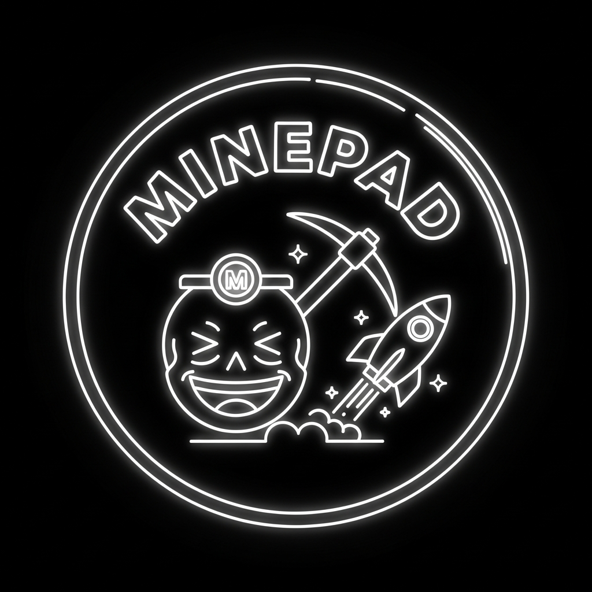

<div align="center">
  

  # ACTFUN / MINEPAD — Mine to Launch

  **The first community-mined token launchpad on Arc Network.**
  Mine tokens by writing something funny. 100% onchain. No VCs. No team allocation. Pure community.

  [](https://testnet.arcscan.app)
  [](LICENSE)
  [](https://actfun.xyz)
  [](https://x.com/ACTFUNmine)
  [](https://actfun-761788d6.mintlify.app/quickstart)

</div>

---

## What is ACTFUN?

ACTFUN is a **Pump.fun-style token launchpad built natively on Arc Network** — but with a twist that changes everything.

Instead of buying into a bonding curve, **your community earns the token supply by writing funny posts**. Every mine is a real on-chain transaction. The mining fee goes directly into a liquidity pool. When 95% of the supply is mined within the graduation window, the token automatically graduates and opens for live trading via a built-in constant-product AMM (x\*y=k). No external DEX. No migration. No rug.

> **ACTFUN is what Pump.fun would be if the community actually earned the supply — and got to watch it happen live.**

---

## What Makes ACTFUN Different

| | Pump.fun | ACTFUN |
|---|---|---|
| Token distribution | Bonding curve buy | **Community mines 95% of supply** |
| Liquidity source | Creator provides | **Mining fees auto-seed the pool** |
| DEX | External (Raydium) | **Built-in AMM + UNITFLOW V3** |
| Launch requirement | Instant | **Community-mined graduation window** |
| Team allocation | Often yes | **Zero — 5% is LP reserve only** |
| Creator tool | None | **Go Live: WebRTC stream + chat** |
| Participation | Passive buying | **Active — write something funny** |
| Backend | Centralized servers | **100% onchain — pure RPC** |
| Failure mode | Creator rugs | **Refund mechanism if not graduated** |
| Data layer | Off-chain | **Goldsky indexed live feed** |

---

## The Mine-to-Launch Flow

```
┌─────────────────────────────────────────────────────────┐
│                                                         │
│  1. CREATE    Anyone deploys a token via LaunchpadFactory │
│               Free on testnet. Set: name, symbol, image, │
│               supply, mine amount, cooldown, daily cap,  │
│               fee per mine, refund window.               │
│                                                         │
│  2. MINE      Community mines 95% of supply by writing   │
│               funny posts on-chain.                      │
│               Each mine = small USDC fee → accumulates.   │
│               Rules enforced on-chain: cooldown,         │
│               daily cap, supply cap.                     │
│                                                         │
│  3. GRADUATE  At 95% mined → contract auto-graduates:   │
│               • Mints 5% LP reserve tokens to itself     │
│               • Seeds creator-selected AMMs: UNITFLOW V3 │
│                 + Uniswap V2 + Curve StableSwap (pick 1-3) │
│               • LP NFT locked forever in the contract    │
│                                                         │
│  4. TRADE     Buy/sell via built-in AMM on the same page │
│               No migration. No external DEX. Instant.    │
│                                                         │
│  FAIL SAFE    Didn't graduate in time?                   │
│               → Refund window opens for all miners       │
│                                                         │
└─────────────────────────────────────────────────────────┘
```

---

## Architecture

### Factory → Launcher → Token Flow


**LaunchpadFactory** (`0xD3a6...7a4B`) deploys two contracts per token:
1. **LaunchToken** — standard ERC-20 with `imageUri` stored on-chain
2. **TokenLauncher** — per-token miner + AMM that owns the token and mints supply

The factory registers every launcher on-chain. Only factory-created launchers are trusted by the UI.

---

## Tokenomics (per launched token)

```
Total Supply
├── 95%  Mineable by community (via funny posts)
└──  5%  LP reserve (auto-minted to contract on graduation)

Mining Fee  → set by creator (e.g. 1 USDC per mine)
            → 100% flows into contract treasury
            → Becomes initial USDC reserve in the AMM on graduation

On Graduation:
  • Initial token reserve = 5% of total supply
  • Initial USDC reserve  = all accumulated mining fees
  • Creator-selected AMMs seeded (UNITFLOW V3, Uniswap V2, Curve StableSwap)
  • LP NFT held forever by the contract — no rug possible

AMM Formula:
  tokensOut = usdcIn × tokenReserve / (usdcReserve + usdcIn)   (x·y=k)
```

**No pre-mine. No team wallet. No VC allocation. The creator gets community glory and a Go Live button.**

---

## Features

### 🏠 Homepage — Token Grid
- **New / Trending / Graduated tabs** — live mining progress bars, miner counts
- **Search** — find tokens by name or symbol
- **⛏️ "You mined" badge** — your grid highlights every token you've contributed to
- **Auto-hides expired tokens** — tokens that didn't graduate within their window disappear automatically
- **Global Live Feed** — real-time on-chain activity from every token on the platform

### 🚀 Create Token
- Deploy a full ERC-20 + AMM contract pair in one transaction
- Set name, symbol, image (emoji, URL, or uploaded photo), max supply, mine amount, cooldown, daily cap, fee per mine
- **Refund window** — configurable by creator (platform default: 1 hour = 3600 seconds)
- **Post-launch share screen** — immediately after deployment confirms:
  - Token image, name, symbol
  - **"Share on X"** — one-click tweet with pre-filled text and OG share link
  - **"Copy link"** — copies the share URL to clipboard
  - **"Share Card"** — opens the visual card page
  - **"Go to token page"** — navigate directly to mining/swap page
  - **Arcscan link** — verify the contract on-chain

### ⛏️ Mine Page (pre-graduation)
- **Write something funny** — your post is recorded permanently on-chain via the `ActedFun` event
- **Mining progress bar** — live % toward graduation
- **Graduation countdown** — live timer counting down to the refund deadline; turns red in the final 10 minutes
- **Cooldown display** — live countdown to next mine
- **Funny post activity feed** — see everyone's mining posts in real time
- **Leaderboard** — top miners ranked by total tokens mined
- **Graduation alerts** — browser toast notifications at 75% mined and on graduation

### 💱 Swap Page (post-graduation)
- **Buy tokens** — direct USDC → token swap via creator-selected AMMs (UNITFLOW V3, Uniswap V2, or Curve StableSwap)
- **Sell tokens** — two-step approve + sell flow (ERC-20 approve handled automatically)
- **Live price chart** — full trade history rendered as a price chart, built from on-chain Swap events
- **Price stats** — current price, all-time high, all-time low, total trades
- **Share on X** — one-click tweet with card link that renders a rich image preview

### 🃏 Shareable Token Cards
Every token gets a shareable card page and X-optimized image preview.

**Share URL:** `actfun.xyz/api/share/:launcherAddress`

When posted on X:
- X's bot gets proper `twitter:card: summary_large_image` meta tags
- A **1200×630 PNG card image** is generated on-demand server-side showing:
  - Token image / emoji
  - **🎓 WON** (green), **💀 LOST** (red), or **⛏️ MINING** (blue) status badge
  - Mining progress bar with % and miner count
  - Top 3 community mining posts as a chat thread
  - ACTFUN branding

When a real user clicks the link:
- Redirected to `/card/:address` — a full visual card page with share/copy buttons and a "Trade this token" CTA

### 🎥 Creator Livestream
- **Go Live button** — creator broadcasts directly from the token page (no streaming account needed)
- **WebRTC peer-to-peer** — video streams from creator to all viewers in real time
- **Live chat** — full chat alongside the stream, works for creator and viewers
- **Viewer count** — live count of how many people are watching
- **Auto-detects live status** — viewers see a pulsing 🔴 LIVE badge when creator is streaming

### 🔔 Graduation Alerts
- Tracks every token you've mined in browser localStorage
- Background poller checks progress every 45 seconds
- **🔥 75% milestone** — amber toast notification: "Almost there, mine now!"
- **🎓 Graduation** — green toast: "It's trading live!"
- Each notification fires exactly once, auto-dismisses after 9 seconds, click to navigate

### 📡 Global Live Feed
Powered by **Goldsky Turbo** pipeline streaming Arc testnet events into Neon Postgres.
- Shows **all** on-chain activity across every ACTFUN token
- Filter by: All / Mines / Buys / Sells / Graduations
- Live pulse indicator when new events arrive
- Pause button to freeze the feed
- Each row shows: token image, user address, event type, amount, funny post text, timestamp
- **"Powered by Goldsky"** badge — real-time infrastructure

### 💰 Refund Window
If a token does not graduate before the refund deadline expires:
- The token page shows an **"Expired"** badge
- A **"Claim Your USDC Refund"** section appears at the bottom of the right panel
- Live **countdown timer** shows how long until the refund window opens
- Each miner sees their **claimable USDC amount** (all fees they paid)
- One-click **Claim Refund** button — contract sends USDC back to the wallet
- If already claimed, shows "Refund claimed!" confirmation
- Only wallets that actually mined the token can claim

The refund logic is enforced in Solidity:
- `claimRefund()` only works if `!graduated` AND `block.timestamp > createdAt + refundWindowSeconds`
- `claimableRefund(user)` returns `feePaid[user]` when the window is expired
- `refundWindowOpen()` returns `true` while the window is still open

### 📊 Contract Info Panel
- Launcher address (Arcscan link)
- Token contract address
- Cooldown, daily max, fee per mine, graduation window
- Creator address

---

## Smart Contracts

### Three Contracts

```
contracts/src/
├── LaunchToken.sol        Standard ERC-20 per launched token
│                          • OpenZeppelin 5.x ERC-20 with `imageUri`
│                          • `maxSupply` cap, mintable only by owner
│                          • Owner = TokenLauncher (factory sets this)
│
├── TokenLauncher.sol      Per-token miner + AMM + refund in one contract
│                          • mine(post) — write post, pay fee, receive tokens
│                          • Cooldown enforced per wallet (`lastMineTime`)
│                          • Daily cap enforced per wallet per day (`dailyMined`)
│                          • Supply cap: reverts if `mineableSupply` exceeded
│                          • `_graduate()` — auto-called at 95% mined
│                          • UNITFLOW V3 full-range liquidity seeding
│                          • `buyTokens()` / `sellTokens()` — post-graduation AMM
│                          • `claimRefund()` — if expired without graduating
│                          • `claimableRefund(user)` — view refund amount
│                          • `refundDeadline()` — view deadline timestamp
│                          • `refundWindowOpen()` — bool check
│                          • `getMiningProgress()` → (mined, total)
│                          • `getTimeUntilNextMine(user)` → seconds
│                          • `getRemainingDailyAllowance(user)` → tokens
│
└── LaunchpadFactory.sol   Registry + factory
                           • `createToken(...)` → deploys (LaunchToken, TokenLauncher) pair
                           • `getTokenCount()` → total tokens launched
                           • `getTokens(from, count)` → paginated registry
                           • `getAllTokens()` → full array
                           • `creationFee`, `feeRecipient` (owner-controlled)
                           • `launcherByToken` mapping — token → launcher
                           • `isLauncher` mapping — verify launcher validity
```

### Events

```solidity
event ActedFun(
    address indexed user,
    string  funnyPost,
    uint256 amount,
    uint256 timestamp
);

event TokenGraduated(
    address indexed token,
    uint256 tokenSeeded,
    uint256 arcSeeded,
    uint256 timestamp
);

event ArcRefundClaimed(
    address indexed user,
    uint256 amount,
    uint256 timestamp
);
```

### Deployed on Arc Testnet (Chain ID 5042002)

| Contract | Address | Version |
|---|---|---|
| LaunchpadFactory | [`0xD3a684B4D9aA0E92E79ade7DcaB70A8b125A7a4B`](https://testnet.arcscan.app/address/0xD3a684B4D9aA0E92E79ade7DcaB70A8b125A7a4B) | v15 (current) |
| UNITFLOW V3 Router | `0x509cF58CdA08C7aee83a2BdBb4A1Eac907343D01` | — |
| UNITFLOW V3 PositionManager | `0x77c39eB310BE31e60068CE29855F83359bf85fc4` | — |
| UNITFLOW V3 Factory | `0xAb6A8AAb7d490007634ef59d424b5d89688a1971` | — |
| WUSDC | `0x911b4000D3422F482F4062a913885f7b035382Df` | — |
| UNITFLOW V3 Quoter | `0x121aeB6DEf00F6F67665008CaC1C19805886ed1a` | — |

Fee tier: 3000 (0.30%), full-range ticks: -887220 / 887220

Each deployed token pair (LaunchToken + TokenLauncher) is created by the factory and registered on-chain. The factory is the source of truth for all valid ACTFUN tokens.

---

## Event Indexing & Data Infrastructure

### Goldsky Turbo Pipeline → Neon Postgres

Historical event data is NOT read via RPC `getLogs` in the browser. A **Goldsky Turbo** pipeline (`actfun-analytics`) streams matching Arc testnet raw logs into a Neon Postgres table `public.actfun_events`:

- `GET /api/onchain-events?addresses=<csv>&events=<csv>&limit=<n>` — queries Neon, decodes each row with viem `decodeEventLog`
- Browser never touches Postgres directly
- If the table doesn't exist, the endpoint returns `{ events: [] }` gracefully
- Consuming hooks: `useGlobalFeed`, `useLauncherEvents`, `usePriceHistory`

### Goldsky Subgraph (GraphQL)

A separate Goldsky **subgraph** (`actfun/1.0.1`) provides a GraphQL API:
- Factory pattern: `TokenCreated` spawns `TokenLauncher` template
- `TokenGraduated` spawns `UnitFlowV3Pool` template per pool
- Entities: `Token`, `Mine`, `Graduation`, `RefundClaim`, `Swap`
- GraphQL API: `https://api.goldsky.com/api/public/project_cmpo47hdxggoa01tld31sbkfy/subgraphs/actfun/1.0.1/gn`

---

## The Arc Ecosystem Stack

ACTFUN is built on the full Arc testnet ecosystem, day one:


| Layer | Partner | Status |
|---|---|---|
| Wallet connection | @dynamic_xyz | ✅ Live on testnet |
| AMM + Liquidity | @CurveFinance + UNIFLOW | ✅ Live on testnet |
| Data infrastructure | @goldskyio | ✅ Live on testnet |
| Contract audit | @sherlockdefi | 🔒 Mainnet day one |
| Chain | Arc Testnet → Mainnet | 🚀 Day one |

---

## Tech Stack

| Layer | Technology |
|---|---|
| Blockchain | Arc Testnet · EVM · Chain ID 5042002 |
| Contracts | Solidity 0.8.24 · OpenZeppelin 5.x · Hardhat (viaIR: true) |
| Frontend | React 18 · Vite · Tailwind CSS · TypeScript |
| Routing | wouter |
| Web3 | wagmi v2 · viem |
| Wallet | Dynamic Labs SDK (injected connector) |
| Real-time | WebSocket (ws) · WebRTC mesh for livestreams |
| API | Express 5 (OG cards + WebSocket signaling) |
| Data | Goldsky Turbo → Neon Postgres + Goldsky Subgraph |
| Monorepo | pnpm workspaces · Node.js 24 |

---

## Repository Structure

```
actfun/
├── contracts/                      Solidity contracts (Hardhat)
│   ├── src/
│   │   ├── LaunchpadFactory.sol
│   │   ├── TokenLauncher.sol
│   │   └── LaunchToken.sol
│   ├── scripts/
│   │   ├── deploy-launchpad.js     Deploy factory
│   │   └── query-tokens.js         Query deployed tokens
│   └── hardhat.config.js           viaIR: true (required)
│
├── artifacts/actfun/               React + Vite frontend dApp
│   ├── public/
│   │   └── minepad-logo.png
│   └── src/
│       ├── pages/
│       │   ├── HomePage.tsx        Token grid + Global Feed
│       │   ├── CreateTokenPage.tsx Launch form
│       │   ├── TokenDetailPage.tsx Mine / swap / stream / refund
│       │   └── CardPage.tsx        Shareable token card page
│       ├── components/
│       │   ├── MiningPanel.tsx     Mine action UI
│       │   ├── SwapPanel.tsx       Buy/sell UI (UNITFLOW V3)
│       │   ├── PriceChart.tsx      Live chart
│       │   ├── LiveStream.tsx      WebRTC stream + chat
│       │   ├── TokenCard.tsx       Homepage grid card
│       │   ├── GraduationAlerts.tsx Toast notifications
│       │   ├── GlobalFeed.tsx      Live activity feed (all tokens)
│       │   └── GoldskyBadge.tsx    "Powered by Goldsky"
│       ├── context/
│       │   └── MiningTrackerContext.tsx  Mine tracking + alerts
│       ├── hooks/
│       │   ├── useFactory.ts       Token list + createToken
│       │   ├── useTokenLauncher.ts Mine / swap / events / refund
│       │   ├── usePriceHistory.ts  Chart data
│       │   ├── useCountdown.ts     Countdowns
│       │   └── useGlobalFeed.ts    Global feed query
│       └── lib/
│           ├── wagmi.ts            Arc testnet chain config
│           └── contracts.ts        ABIs + addresses
│
├── artifacts/api-server/           Express 5 API
│   └── src/
│       ├── lib/
│       │   ├── neon.ts             Neon DB read pool
│       │   ├── liveRooms.ts        In-memory WebRTC room state
│       │   └── wsServer.ts         WS upgrade handler
│       └── routes/
│           ├── events.ts           /api/onchain-events (Neon queries)
│           ├── live.ts             /api/live/:addr WebSocket
│           └── share.ts            /api/share/:addr OG + /api/og-image/:addr PNG
│
├── artifacts/actfun-mobile/        React Native / Expo mobile app
├── artifacts/minepad-video/        Animated promo video
├── scripts/                         Utility scripts
│   └── src/
│       └── backfill-actfun-events.ts  RPC backfill for Neon
├── goldsky/                         Turbo pipeline config
│   └── actfun-turbo.yaml
├── subgraph/                        Goldsky Subgraph (standalone)
│   ├── schema.graphql
│   └── src/
├── lib/                             Shared TypeScript libraries
└── pnpm-workspace.yaml              Monorepo config
```

---

## Running Locally

**Requirements:** Node.js 24, pnpm 10, MetaMask

```bash
git clone https://github.com/actfun/actfun.git
cd actfun
pnpm install

# Frontend dApp
pnpm --filter @workspace/actfun run dev

# API server — needed for livestream + OG cards
pnpm --filter @workspace/api-server run dev

# Typecheck everything
pnpm run typecheck
```

**Add Arc Testnet to MetaMask:**
| Field | Value |
|---|---|
| Network Name | Arc Testnet |
| RPC URL | `https://rpc.testnet.arc.network` |
| Chain ID | `5042002` |
| Symbol | `USDC` |
| Explorer | `https://testnet.arcscan.app` |

Get testnet USDC from the [Arc faucet](https://faucet.testnet.arc.network).

---

## Deploy Contracts

```bash
cd contracts
npm install
echo "PRIVATE_KEY=0xyourkey" > .env
CI=true npm run deploy-launchpad
# → Outputs new LaunchpadFactory address
# → Update artifacts/actfun/src/lib/contracts.ts with the new address
```

> Hardhat requires `viaIR: true` in `hardhat.config.js` to avoid stack-too-deep errors on LaunchpadFactory.

---

## Why Arc Network?

Arc is an EVM-compatible L1 built for speed. Sub-second finality is what makes ACTFUN feel alive:

- **Mining cooldowns feel instant** — transaction confirms before you finish reading the success message
- **Graduation window** — tight enough to create real urgency, fast enough to not frustrate
- **Live leaderboard** — updates in near real time as mines confirm
- **AMM swaps** — settle before you blink
- **Negligible gas** — anyone can mine without worrying about fees eating their rewards

ACTFUN is the first launchpad native to Arc testnet, purpose-built to show what happens when you combine EVM speed with zero-backend architecture and community-driven tokenomics.

---

## Architecture Decisions

**Why no backend for core flows?**
Everything that matters — supply, fees, graduation, refunds — lives in Solidity. The API server only handles WebSocket signaling for livestream and OG card generation. If the server goes down, the launchpad still works 100%.

**Why a graduation window?**
It creates urgency. A token either catches fire or it doesn't. This prevents zombie tokens from sitting unfinished and gives the homepage a constantly fresh grid.

**Why built-in AMM + UNITFLOW V3?**
On-chain graduation is fully automatic and atomic. No migration transaction. No external dependency. The LP NFT is locked forever in the contract — no one can remove liquidity. The mining fees that went in come out as the initial liquidity.

**Why funny posts?**
Mining requires a string argument. Making it a funny post turns a mechanical fee payment into a social action. The activity feed becomes readable entertainment. The token with the best posts wins cultural mindshare.

**Why the refund mechanism?**
If a token doesn't gain enough community traction to graduate, miners shouldn't lose their USDC. The contract tracks `feePaid[user]` for every miner and allows a full refund after the window expires. This creates a safe, no-risk participation model.

---

## Security Model

All economic invariants are enforced in Solidity — not in React:

| Invariant | Enforcement |
|---|---|
| Supply cap | Contract reverts if `mineableSupply` exceeded |
| Cooldown | Per-wallet, stored on-chain, enforced in `mine()` |
| Daily cap | Per-wallet per day, on-chain counter |
| AMM reserve integrity | Miners cannot reclaim fees that seeded liquidity |
| Graduation | Irreversible once triggered, fully automatic |
| Refund eligibility | Only after refund window expires without graduating |
| Factory trust | Only launchers deployed by LaunchpadFactory are valid |
| LP lock | LP NFT held by TokenLauncher forever — no rug |

---

## Roadmap

- [ ] Arc mainnet deployment
- [ ] IPFS image pinning for token metadata
- [ ] Creator revenue share (% of post-graduation AMM fees)
- [ ] Governance: community votes on launchpad parameters
- [ ] Mobile app (Expo / React Native)
- [ ] Multi-chain graduation (graduate to Uniswap on other chains)

---

## Contributing

This repo is fully open source under MIT. PRs welcome.

1. Fork the repo
2. Branch off `main`
3. Open a PR with a clear description of what you changed and why

**Contract changes:** Do not modify deployed contract logic. Create a new factory version and update the address in `artifacts/actfun/src/lib/contracts.ts`.

---

## Links

| | |
|---|---|
| 🌐 Live app | https://actfun.xyz |
| 📖 Docs | https://actfun-761788d6.mintlify.app/quickstart |
| 🐦 X / Twitter | https://x.com/ACTFUNmine |
| 🔍 Arc Explorer | https://testnet.arcscan.app |
| 📜 Factory contract | [0x6A3Cf...dc49D4](https://testnet.arcscan.app/address/0xD3a684B4D9aA0E92E79ade7DcaB70A8b125A7a4B) |

---

<div align="center">
  <strong>Built on Arc. Mined by community. Graduated by memes. </strong>
  <br /><br />
  <sub>ACTFUN is deployed on Arc testnet. Not financial advice. Mine responsibly.</sub>
</div>
